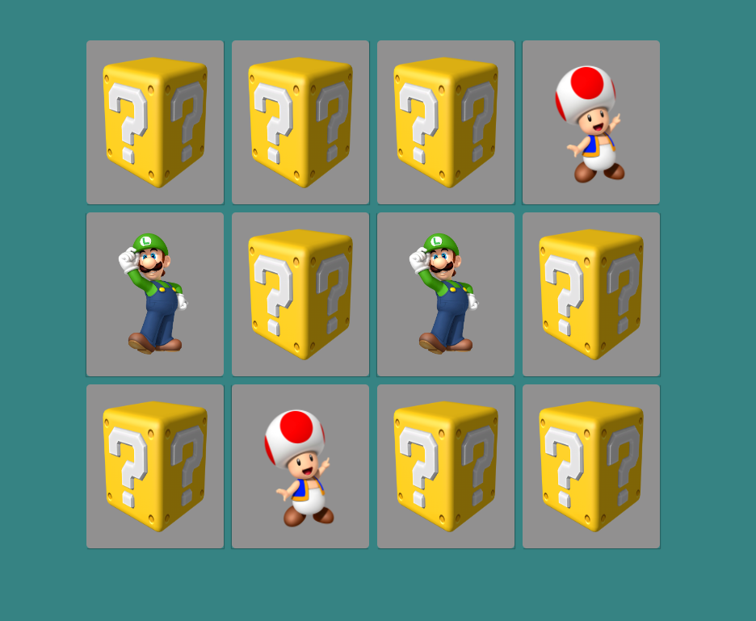

  
  
<a href="https://memory-game-woad-ten.vercel.app/">CLICK HERE FOR FULL PAGE<a>

# English :canada:
JavaScript memory game based on Mario Bros' characters. 

## JavaScript :man_technologist:
The JavaScript portion of this project is responsible for virtually the whole game. 
JS functions were created to:
- shuffle all cards;
- flip a chosen card;
- unflip cards (in case of a mismatch);
- check for card match.
 
Function "shuffleCards" is called everytime the page is reloaded. 
From there, an event listener is added to each card and the rules to the game are applied.
    
### Things to improve:
I'd like to add an alert when the game once it's done. 
The alert would congratulate the user for winning the game and asking for a rematch. 
 
Although still playable in smaller screens, it can't be said the game is screen responsive.

# Português :brazil:
Jogo da memória, feito em JavaScript, com os personagens de Mario Bros. 

## JavaScript :man_technologist:
A seção de JavaScript do projeto é responsável por praticamente o jogo todo. 
Funções foram criadas para:
- embaralhar as cartas;
- virar uma carta selecionada;
- desvirar as cartas (em caso de "erro" do usuário);
- checar se as cartas coincidem.
 
A função "shuffleCards" é chamada toda vez que a página é carregada. 
Então. um event listener é adicionado a cada carta e as regras do jogo são aplicadas.
    
### Pontos a melhorar:
Gostaria de adicionar um alerta ao final do jogo. 
O alerta parabeniza o usuário por completar o jogo e dá a opção de jogar novamente. 
 
Embora ainda possível jogar em telas menores, não pode-se dizer que o jogo apresenta responsividade.
