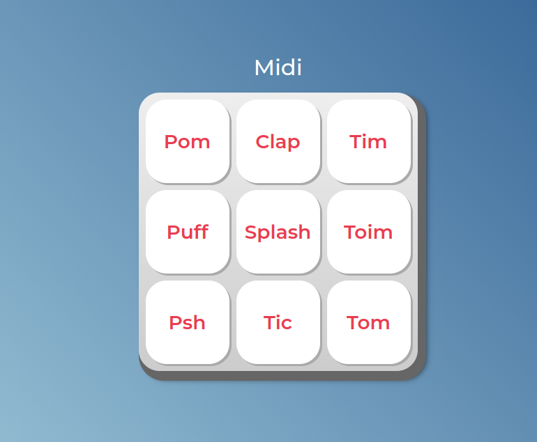

  
  
<a href="https://digital-instrument-player.vercel.app/">CLICK HERE FOR FULL PAGE<a>

# English :canada:
Simple instrument player using JavaScript.
    
## JavaScript :man_technologist:
The JS portion of the project is pretty short, so just one file seemed enough. 
Only one function was created, _tocaSom_, which is responsible for playing the appropriate sound. 
Once defined, _querySelectorAll_ creates an array of the possible keys.  
Then, the _tocaSom_ function is applied to all keys through a _for loop_. 
 
### Things to improve:
All sounds are accessible through the keyboard as well. The _tab_ key will take the user to the desired sound, which will be highlighted. 
Then, each sound can be played by pressing the _space_ or _enter_ key. 
However, I'd still like to implement a function in which each sound is accessed through specific keyboard keys.

## CSS :art:
Design isn't quite the focus of this projec. With that in mind, only two CSS files were created:
- Reset CSS;
- estilos (styles).
     
Positioning is quite simple, given the _flex_ and _grid_ property were used.
    
# Português :brazil:
Simples player de instrumento digital utilizando JavaScript.
    
## JavaScript :man_technologist:
o JS necessário para o projeto é bem curto, então optei por apenas um arquivo. 
Somente uma função foi criada, _tocaSom_. 
Uma vez criada, _querySelectorAll_ cria um vetor com as teclas possíveis. 
A função _tocaSom_ é, então, aplicada em todas as teclas por um _for loop_. 
 
### Pontos a melhorar:
Todos os sons são acessíveis pelo teclado. A tecla _tab_ permite que o usário navegue até o som desejado, que fica destacado. 
Cada som pode, então, ser tocado ao pressionar a tecla _espaço_ ou _enter_. 
Ainda assim, gostaria de implementar uma função na qual cada som possa ser acessado por teclas específicas.
    
## CSS :art:
O design não é o foco deste projeto. Com isso em mente, apenas dois arquivos CSS foram criados:
- Reset CSS;
- estilos.
 
O posicionamento é bem simples, dado que as propriedades _flex_ e _grid_ foram utilizadas.
